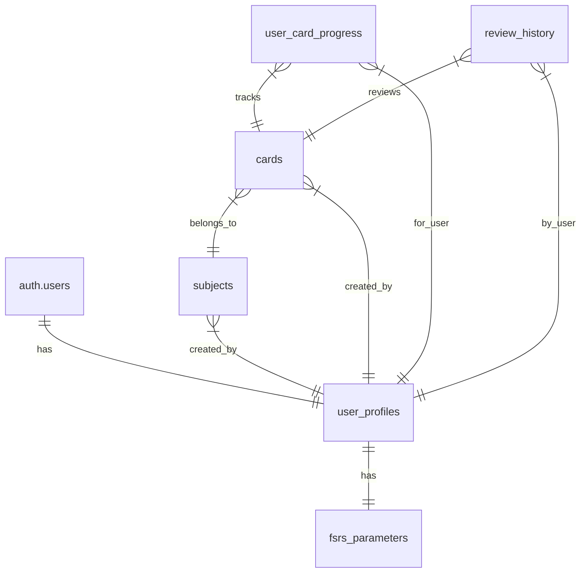

# Database Migrations

This directory contains the database migrations for the Flashcard App. The migrations are designed to be run in sequence and build upon each other to create the complete database schema.

## Migration Order

1. `01-initial-setup.sql` - Basic database setup
   - Extensions (uuid-ossp)
   - Storage buckets
   - Helper functions
   - Common triggers

2. `02-user-profiles.sql` - User authentication and profiles
   - User profile table
   - Profile creation trigger
   - RLS policies
   - Access control

3. `03-subjects.sql` - Subject organization
   - Subjects table
   - Access control functions
   - RLS policies
   - Indexing

4. `04-cards.sql` - Flashcard content
   - Cards table
   - Content validation
   - Access control
   - Performance indexes

5. `05-user-card-progress.sql` - Learning progress
   - Progress tracking table
   - FSRS state management
   - Learning state transitions
   - Performance optimization

6. `06-review-history.sql` - Review history
   - Review log table
   - FSRS state tracking
   - Performance metrics
   - Historical data

7. `07-fsrs-parameters.sql` - Algorithm settings
   - FSRS parameters table
   - Default algorithm values
   - User customization
   - Validation constraints

8. `08-initialize-fsrs.sql` - FSRS initialization
   - Parameter initialization
   - Default values setup
   - Error handling
   - Logging

9. `09-consolidated-triggers.sql` - User initialization
   - Combined user creation trigger
   - Profile creation
   - FSRS initialization
   - Error handling

## Running Migrations

1. Connect to your Supabase project's SQL editor
2. Run each migration in sequence (01 through 09)
3. Verify each migration completes successfully before proceeding
4. Check the logs for any error messages

## Important Notes

- All tables have Row Level Security (RLS) enabled
- Each table has appropriate indexes for performance
- Triggers use SECURITY DEFINER for proper permissions
- Error handling and logging are included
- All necessary permissions are granted

## Security Features

- RLS policies protect user data
- Function-level security with SECURITY DEFINER
- Proper permission grants
- Input validation
- Error handling

## Maintenance

When making schema changes:
1. Create a new numbered migration file
2. Include both UP and DOWN migrations
3. Test thoroughly before applying
4. Document changes in this README

## Troubleshooting

If you encounter errors:
1. Check the Supabase logs
2. Verify migrations ran in order
3. Check for permission issues
4. Verify trigger functions
5. Check RLS policies

## Dependencies

- Supabase project
- UUID extension
- Storage buckets for avatars
- Postgres 14 or higher

## Data Model

## Contact

For questions or issues:
1. Check the troubleshooting guide
2. Review Supabase documentation
3. Contact the development team 