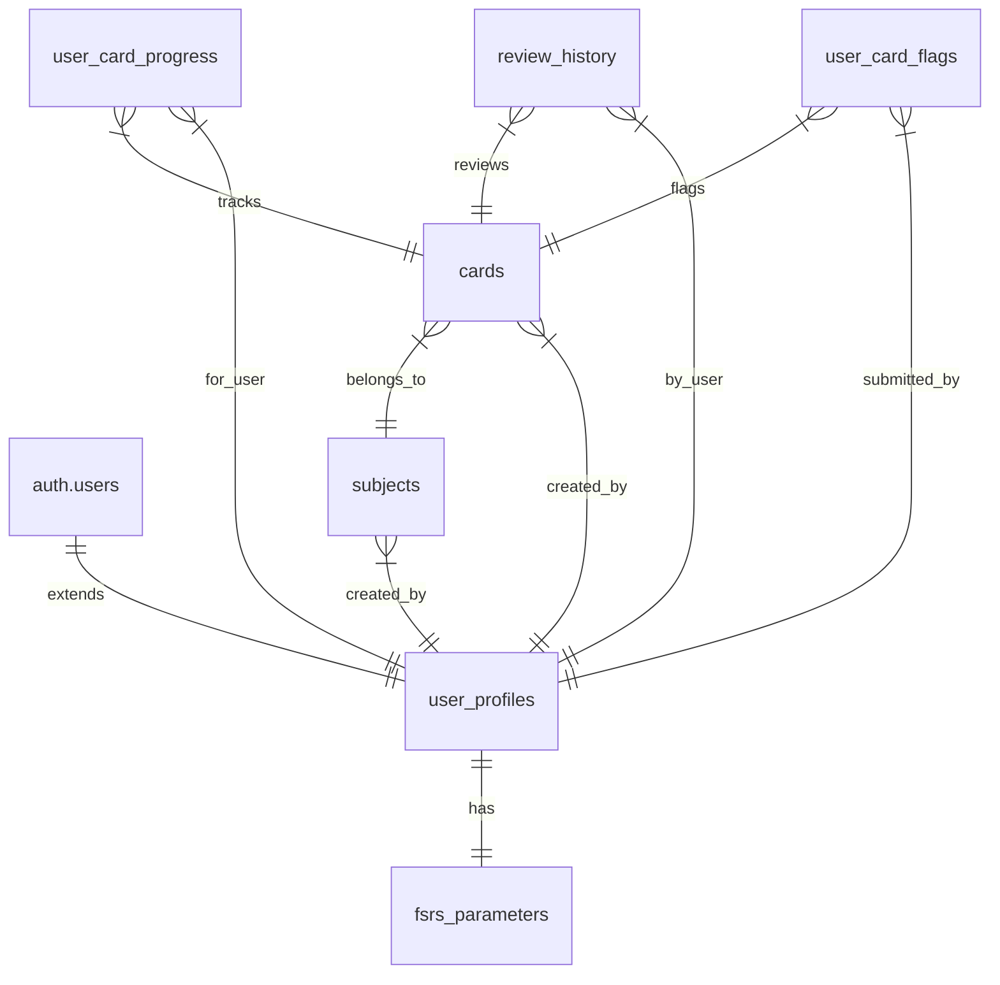

# Database Migrations

This directory contains SQL migration files that can recreate the entire Supabase database schema from scratch. The migrations are numbered sequentially and should be run in order. **These migrations exactly match the current production schema.**

## Migration Files (Sequential Order)

1. **01-initial-setup.sql** - Basic database setup, extensions, and helper functions
2. **02-enums.sql** - All custom enum types (user_tier, card_state, flag_reason)
3. **03-user-profiles.sql** - User profiles table with authentication and tier system
4. **04-subjects.sql** - Subjects table for organizing flashcards with hierarchical structure
5. **05-cards.sql** - Cards table for flashcard content with multimedia and flagging support
6. **06-user-card-progress.sql** - User progress tracking with complete FSRS implementation
7. **07-review-history.sql** - Detailed review history for FSRS calculations and analytics
8. **08-fsrs-parameters.sql** - Personalized FSRS algorithm parameters per user
9. **09-user-card-flags.sql** - User flagging system for reporting card issues
10. **10-functions-and-procedures.sql** - Helper functions and stored procedures
11. **11-policies-and-security.sql** - Additional RLS policies and security enhancements
12. **12-sample-data.sql** - Optional sample data for development environments
13. **13-advanced-analytics-schema.sql** - Advanced analytics views and functions (difficulty consistency only)
14. **15-fix-admin-function.sql** - Admin function fixes
15. **16-fix-function-return-types.sql** - Function return type fixes
16. **17-fix-analytics-return-types.sql** - Analytics function return type fixes (difficulty only)
17. **19-remove-hesitation-error-analytics.sql** - Remove hesitation and error pattern analytics
18. **20-failed-attempts-before-good-rating.sql** - Add function to calculate failed attempts before first good rating

## Key Features Implemented

### Database Schema
- **Custom Enums**: `user_tier` (free/paid/admin), `card_state` (FSRS states), `flag_reason` (user flagging)
- **Full FSRS Support**: Complete Free Spaced Repetition Scheduler implementation
- **User Tier System**: Free (20 reviews/day), Paid (unlimited), Admin (unlimited + management)
- **Dual Flagging System**: Admin flagging for content control + user flagging for issue reporting
- **Row Level Security**: Comprehensive RLS policies protecting all user data

### Tables Created
- **user_profiles** - Extended user data with tiers, statistics, and daily limits
- **subjects** - Hierarchical subject organization with visual customization
- **cards** - Flashcard content with multimedia support, statistics, and flagging
- **user_card_progress** - Complete FSRS learning state and progress tracking
- **review_history** - Detailed review logs for FSRS calculations and analytics
- **fsrs_parameters** - Personalized algorithm parameters per user
- **user_card_flags** - User-submitted flags for card issues with admin resolution

### Functions and Procedures
- **User Management**: Tier-based access control and daily limit enforcement
- **FSRS Implementation**: Complete algorithm functions and parameter management
- **Flagging System**: Card flagging workflows for both users and admins
- **Daily Limits**: Automatic reset and tracking of daily review counts

## Usage

### Fresh Database Setup
Run migrations in sequential order:
```sql
-- Connect to Supabase SQL Editor and run each file in order
\i 01-initial-setup.sql
\i 02-enums.sql
\i 03-user-profiles.sql
\i 04-subjects.sql
\i 05-cards.sql
\i 06-user-card-progress.sql
\i 07-review-history.sql
\i 08-fsrs-parameters.sql
\i 09-user-card-flags.sql
\i 10-functions-and-procedures.sql
\i 11-policies-and-security.sql
\i 12-sample-data.sql  -- Optional for development
```

### Development Environment
Include file 12 (sample data) for testing and development purposes.

### Production Environment
Skip file 12 (sample data) for production deployments.

## Schema Alignment

✅ **These migrations are the single source of truth** - they exactly match the current Supabase production schema including:
- All column names, data types, and constraints
- All enum types and their values
- All relationships and foreign keys
- All indexes and performance optimizations
- All RLS policies and security settings
- All functions and stored procedures

No functionality will be lost when using these migrations.

## Migration History

### Refactoring (June 2024)
- Consolidated duplicate migration files
- Aligned all schemas with production database
- Created clean sequential numbering (01-12)
- Added comprehensive enum support
- Enhanced user tier and flagging systems

### Key Changes Made
- **Enums**: Replaced TEXT constraints with proper enum types
- **Column Names**: Standardized naming (e.g., `response_time_ms` vs `response_time`)
- **Missing Fields**: Added all fields present in production schema
- **Consolidation**: Combined related functionality into logical files

## File Structure

### Current Files (01-12)
Clean, sequential migration files aligned with production schema.

### Backup Files (*.OLD)
Previous migration versions backed up with `.OLD` extensions. These can be safely removed after confirming the new migrations work correctly.

### Removed Files
Duplicate and obsolete migration files have been removed:
- Multiple 04, 07, 08, 09 numbered files
- Superseded user-tiers and flagging migrations
- Outdated function definitions

## Security Features

- **Row Level Security**: All tables have comprehensive RLS policies
- **Function Security**: All functions use SECURITY DEFINER where appropriate
- **User Tier Enforcement**: Automatic daily limit and access control
- **Data Protection**: Users can only access their own data (except admins)
- **Audit Trail**: Complete review history and flagging resolution tracking

## Troubleshooting

If you encounter errors:
1. **Check Sequence**: Ensure migrations run in exact order (01-12)
2. **Verify Dependencies**: Each migration depends on previous ones
3. **Check Logs**: Review Supabase logs for detailed error messages
4. **Permission Issues**: Verify database permissions and RLS policies
5. **Schema Conflicts**: Ensure no existing schema conflicts

## Data Model Overview



## Contact

For questions about these migrations:
1. Review this documentation
2. Check Supabase project logs
3. Verify against production schema
4. Contact development team if needed